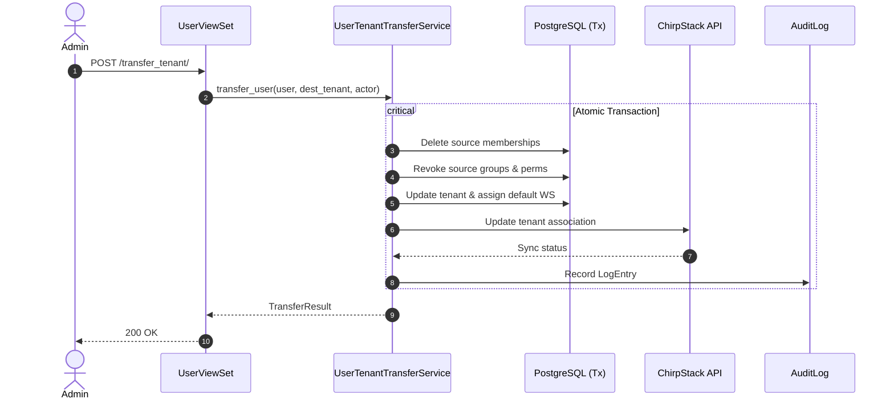

# Design: Core Multitenancy

## Technical Approach
The core-multitenancy architecture establishes tenant boundaries and deterministic lifecycle transfers:
1. **Master Tenant Identification**: Eliminate hardcoded string checks (`"Monitor"`) using indexed `Tenant.is_global` with a database unique constraint and `get_global_tenant()`.
2. **Contextual Scoping**: `TenantContextMiddleware` extracts `X-Tenant-ID`, validates tenant access (membership or global admin), and binds `request.tenant` (defaults to `user.tenant`).
3. **Atomic User Transfer**: `UserTenantTransferService` executes cross-tenant migrations in an atomic transaction: revokes source memberships, groups, and Guardian permissions; assigns destination default workspace with "Sin rol"; syncs ChirpStack `ApiUser`; and writes an `auditlog` entry.

## Architecture Decisions

### Decision: Master Tenant Identification & Invariant
| Option | Tradeoff | Decision |
| :--- | :--- | :--- |
| Hardcoded string (`tenant.name == "Monitor"`) | Fragile; prevents tenant renaming; breaks fixtures. | Rejected |
| Config setting (`settings.MASTER_TENANT_ID`) | Requires deploy config changes; risk of DB desync. | Rejected |
| `Tenant.is_global` + partial unique constraint | Enforces single master tenant at DB level; fast indexed lookup. | **Adopted** |

### Decision: Contextual Tenant Resolution
| Option | Tradeoff | Decision |
| :--- | :--- | :--- |
| Query parameter (`?tenant_id=...`) | URL pollution; leaks in logs; inconsistent across REST actions. | Rejected |
| Subdomain / Host routing | Requires DNS/ingress changes; incompatible with single-domain SPA. | Rejected |
| `X-Tenant-ID` header + middleware | Standard REST convention; clean fallback to primary tenant. | **Adopted** |

### Decision: User Transfer Atomicity & ChirpStack Sync
| Option | Tradeoff | Decision |
| :--- | :--- | :--- |
| Asynchronous task (Celery) | Eventual consistency; temporary permission leakage risk. | Rejected |
| Synchronous atomic DB transaction with resilient API call | Ensures immediate DB consistency; external API failure captured in `ApiUser.sync_status`. | **Adopted** |

## Data Flow


## File Changes
| File | Action | Description |
| :--- | :--- | :--- |
| `Monitor_Atlas/organizations/models.py` | Modify | Add `db_index=True` and partial `UniqueConstraint` on `Tenant.is_global`. |
| `Monitor_Atlas/organizations/helpers.py` | Modify | Standardize `get_global_tenant()` with error handling. |
| `Monitor_Atlas/organizations/middleware.py` | Create | Add `TenantContextMiddleware` resolving `X-Tenant-ID` to `request.tenant`. |
| `Monitor_Atlas/organizations/views.py` | Modify | Replace `user.tenant.name == "Monitor"` with `is_global`. |
| `Monitor_Atlas/platform_backend/settings.py` | Modify | Register `TenantContextMiddleware` in `MIDDLEWARE`. |
| `Monitor_Atlas/roles/helpers.py` | Modify | Add `revoke_user_tenant_permissions()` purging groups, memberships, and perms. |
| `Monitor_Atlas/users/services.py` | Create | Add `UserTenantTransferService` orchestrating atomic transfer and ChirpStack sync. |
| `Monitor_Atlas/users/views.py` | Modify | Expose `POST /api/v1/users/{id}/transfer_tenant/` on `UserViewSet`. |

## Interfaces / Contracts
### HTTP Endpoint: User Tenant Transfer
- `POST /api/v1/users/{id}/transfer_tenant/`
- Permissions: `IsAuthenticated`, `IsAnAdminUser`
- Payload: `{"destination_tenant_id": "<tenant_id>"}`
- Response (200 OK):
  ```json
  {"status": "success", "user_id": "<id>", "tenant_id": "<id>", "chirpstack_synced": true}
  ```
- Errors: `400` (validation), `403` (forbidden), `404` (not found).

### Service Interface: `UserTenantTransferService`
```python
class UserTenantTransferService:
    @classmethod
    def transfer_user(cls, user: User, destination_tenant: Tenant, actor: User) -> TransferResult:
        """Atomically migrates user to destination tenant, revokes prior permissions,
        assigns default workspace, syncs ChirpStack, and creates audit log."""
```

### Context Contract: `request.tenant`
Injected by `TenantContextMiddleware` for authenticated requests. Defaults to `request.user.tenant`.

## Testing Strategy
- **Unit Tests**:
  - `Tenant` model rejects second `is_global=True` via unique constraint.
  - `get_global_tenant()` retrieves global tenant or handles missing record.
  - `revoke_user_tenant_permissions()` clears groups, memberships, and Guardian perms.
- **Integration Tests**:
  - `TenantContextMiddleware`: Validates `X-Tenant-ID`, rejects cross-tenant header with 403, 404 for unknown tenant, fallback to `user.tenant`.
  - `transfer_tenant` endpoint: Verifies end-to-end transfer, rollback on failure, and ChirpStack error capture.

## Threat Matrix
| Threat | Severity | Mitigation |
| :--- | :--- | :--- |
| Cross-tenant context spoofing | Critical | Middleware validates membership in target tenant or global admin status before setting `request.tenant`. |
| Residual permissions after transfer | High | Atomic revocation of source memberships, groups, and Guardian permissions. |
| Multiple global tenants | High | DB partial unique constraint (`UniqueConstraint(condition=Q(is_global=True))`). |
| Audit log tampering | Medium | Append-only logging via `django-auditlog` without mutation endpoints. |

## Migration / Rollout
1. **Schema Migration**: Add `db_index=True` and partial unique constraint on `Tenant.is_global`.
2. **Data Migration**: Set `is_global=True` on existing "Monitor" tenant.
3. **Deployment**: Deploy middleware, services, and view updates.
4. **Rollback**: Run `migrate organizations <prev_migration>`, revert settings, restore codebase.

## Open Questions
- None. Requirements and invariants are fully resolved.
