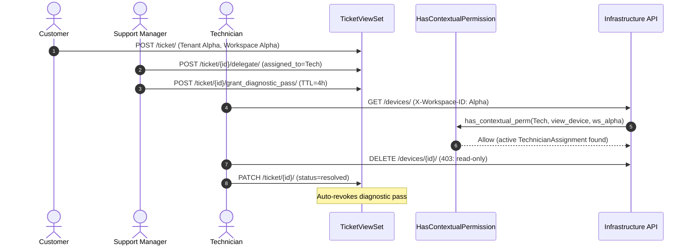

<Design: Support Technician Dispatch>
## Technical Approach
The support subsystem in `Monitor_Atlas` implements multi-tenant isolation and the Hybrid Cross-Tenant Technician Dispatch model. `Ticket` links to `Tenant` (CASCADE) and optional `Workspace` (SET_NULL); `SupportMembership` links to `Tenant`. ViewSets enforce `permission_classes = [IsAuthenticated, HasContextualPermission]` with querysets scoped by `request.tenant` or `assigned_to`.

Master-tenant technicians access assigned tickets via ticket-level delegation (`ticket.assigned_to = technician`). For deep diagnostics, support managers issue a `TechnicianAssignment` pass granting temporary, TTL-bounded read-only access to customer workspace infrastructure. In `roles/permissions.py`, `has_contextual_perm` validates active passes for `SAFE_METHODS` (`view_*`). Ticket resolution or TTL expiry immediately invalidates access. All assignments, delegations, and pass lifecycles are tracked via `auditlog`.

## Architecture Decisions
### Decision: Cross-Tenant Access Model
| Option | Tradeoff | Decision |
|---|---|---|
| Tenant Membership | Broad access violates least-privilege | Rejected |
| Ticket Assignment Only | Blocks infrastructure diagnostics | Rejected |
| Hybrid (Ticket + Pass) | Default ticket access; TTL pass for workspace | Selected |

### Decision: Diagnostic Pass Permission Evaluation
| Option | Tradeoff | Decision |
|---|---|---|
| Workspace Role Injection | Modifies groups; dangling state risk on expiry | Rejected |
| Contextual Evaluator Hook | Checks pass validity in `has_contextual_perm` on `SAFE_METHODS` | Selected |

### Decision: Pass Expiration Enforcement
| Option | Tradeoff | Decision |
|---|---|---|
| Cron Poller | Delayed cleanup leaves exposure windows | Rejected |
| Dynamic TTL + Event Hook | Request-time check (`now < expires_at`) + auto-revocation on close | Selected |

## Data Flow

## File Changes
| File | Action | Description |
|---|---|---|
| `Monitor_Atlas/support/models.py` | Modify | Add tenant/workspace to Ticket and SupportMembership; add TechnicianAssignment with auditlog. |
| `Monitor_Atlas/support/serializers.py` | Modify | Validate workspace-tenant relation in TicketSerializer; add TechnicianAssignmentSerializer. |
| `Monitor_Atlas/support/views.py` | Modify | Add HasContextualPermission, scoped querysets, and delegate/pass actions. |
| `Monitor_Atlas/roles/permissions.py` | Modify | Authorize active passes for read-only SAFE_METHODS in has_contextual_perm; update context extraction. |
| `Monitor_Atlas/support/migrations/0002_support_multitenancy_dispatch.py` | Create | Schema migration for model changes and legacy ticket tenant backfill. |
| `Monitor_Atlas/tests/test_support_dispatch.py` | Create | Integration tests for multi-tenancy, delegation, TTL passes, and audit trails. |

## Interfaces / Contracts
- `POST /api/v1/support/ticket/{id}/delegate/`: Body `{"assigned_to_id": <int>}` -> Status 200: `{"status": "ticket_delegated"}`.
- `POST /api/v1/support/ticket/{id}/grant_diagnostic_pass/`: Body `{"technician_id": <int>, "workspace_id": "<str>", "duration_hours": <int>, "reason": "<str>"}` -> Status 201: `{"id": "<id>", "expires_at": "<iso>", "status": "ACTIVE"}`.
- `POST /api/v1/support/ticket/{id}/revoke_diagnostic_pass/`: Body `{"pass_id": "<id>"}` -> Status 200: `{"status": "pass_revoked"}`.
- `TechnicianAssignment`: `id` (CharField), `technician` (FK User), `ticket` (FK Ticket), `workspace` (FK Workspace), `granted_by` (FK User), `granted_at`, `expires_at`, `status` (`ACTIVE`/`EXPIRED`/`REVOKED`), `reason`. Helper `is_valid()` returns `status == 'ACTIVE' and timezone.now() < expires_at`.

## Testing Strategy
| Test Area | Scope | Verification |
|---|---|---|
| Tenant Isolation | Ticket & Comment ViewSets | Unassigned cross-tenant requests return 403/404 |
| Ticket Delegation | `delegate` action | Assigned technician accesses ticket across tenants; reassignment revokes access |
| Diagnostic Passes | `has_contextual_perm` | Active pass permits `GET` on devices; `POST`/`DELETE` returns 403 |
| Pass Lifecycle | Expiration & closure | `now >= expires_at` or ticket resolution revokes access immediately |
| Audit Trails | `auditlog.LogEntry` | Logs pass grants, revocations, and delegations |

## Threat Matrix
| Threat | Severity | Impact | Mitigation |
|---|---|---|---|
| Cross-Tenant Leakage | High | Customer ticket exposure | Strict `request.tenant` and `assigned_to` queryset scoping |
| Workspace Mutation | High | Unauthorized device alterations | Passes restricted strictly to `SAFE_METHODS` (`view_*`) |
| Dangling Pass Access | Medium | Lingering access post-resolution | Dynamic TTL check and auto-revocation on ticket closure |
| Delegation Repudiation | Low | Untracked access grants | `auditlog` records all pass grants, revocations, and delegations |

## Migration / Rollout
1. Schema migration: Add nullable `tenant` and `workspace` fields to `Ticket` and `SupportMembership`.
2. Data migration: Backfill legacy tickets to owner's tenant or master tenant.
3. Code deployment: Enforce `HasContextualPermission` and activate hybrid dispatch endpoints.
4. Rollback: Run `python manage.py migrate support <prev_migration>` and revert backend code.

## Open Questions
1. Maximum Pass TTL: Should the platform enforce a maximum TTL cap (e.g., 24 hours) for diagnostic passes?
2. Workspace Scope: Should diagnostic passes be strictly limited to `ticket.workspace` or allow any workspace in `ticket.tenant`?
</Design: Support Technician Dispatch>
