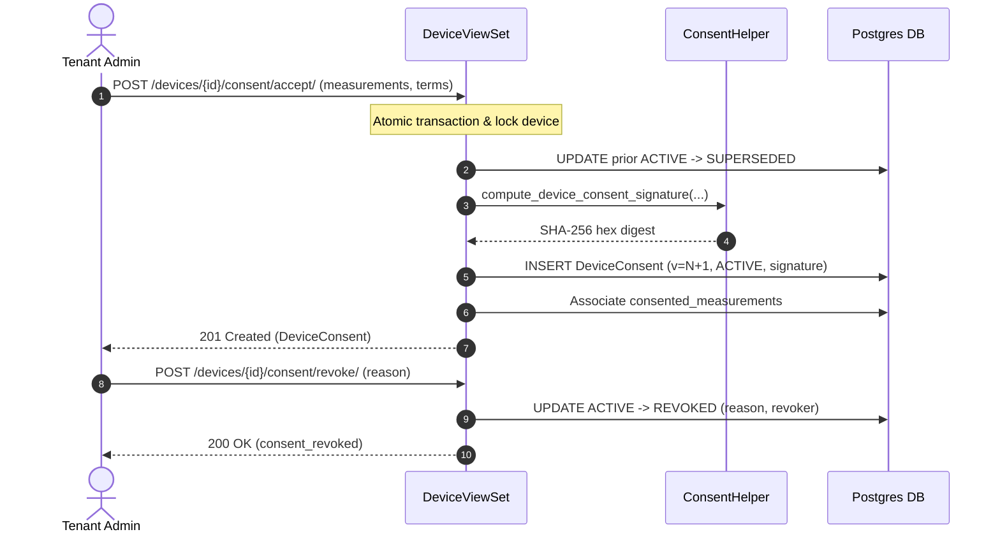

<Design: Device Measurement Consent>
## Technical Approach
The infrastructure subsystem in `Monitor_Atlas` implements a versioned, measurement-granular data consent architecture for device telemetry sharing in AI model training. `Measurements` gains `require_consent = models.BooleanField(default=True)`. The new `DeviceConsent` model links `Device`, `Tenant`, and `Workspace`, enforced by a partial `UniqueConstraint(fields=['device'], condition=Q(status='ACTIVE'))` to allow at most one active consent per device.

Each grant computes a deterministic SHA-256 `device_signature` over canonical metadata (device EUI, tenant, version, terms version, sorted measurement IDs, granter, and ISO timestamp). In `DeviceViewSet`, actions (`consent`, `consent_history`, `accept_consent`, `revoke_consent`) govern the lifecycle: acceptance supersedes active consent and increments version; revocation records a reason. Views and `DeviceConsentViewSet` are secured by `HasContextualPermission`, registered in `roles/catalog.py` under `infrastructure` (`view`, `add`, `change`), and tracked in `auditlog`.

## Architecture Decisions
### Decision: Consent Granularity
| Option | Tradeoff | Decision |
|---|---|---|
| Device-Level Only | Lacks variable flexibility | Rejected |
| Stream Tagging | Excessive per-datapoint storage | Rejected |
| Measurement-Granular M2M | Flexible variable selection bound to device consent | Selected |

### Decision: Active Consent Concurrency Control
| Option | Tradeoff | Decision |
|---|---|---|
| App Locks | Vulnerable to race conditions | Rejected |
| Partial UniqueConstraint | DB-level enforcement on `(device, status='ACTIVE')` in atomic transaction | Selected |

### Decision: Integrity Verification Strategy
| Option | Tradeoff | Decision |
|---|---|---|
| DB Audit Log Only | Vulnerable to direct row tampering | Rejected |
| Asymmetric PKI | Key management overhead | Rejected |
| Canonical SHA-256 + Auditlog | Deterministic hash over sorted payload with audit trails | Selected |

## Data Flow

## File Changes
| File | Action | Description |
|---|---|---|
| `Monitor_Atlas/infrastructure/models.py` | Modify | Add `require_consent` to `Measurements`; add `DeviceConsent` with `UniqueConstraint` and `auditlog`. |
| `Monitor_Atlas/infrastructure/consent_helpers.py` | Create | Cryptographic signature calculation and verification helpers. |
| `Monitor_Atlas/infrastructure/serializers.py` | Modify | Add `require_consent` to `MeasurementsSerializer`; add `DeviceConsent` serializers. |
| `Monitor_Atlas/infrastructure/views.py` | Modify | Add consent actions to `DeviceViewSet`; add `DeviceConsentViewSet`. |
| `Monitor_Atlas/infrastructure/urls.py` | Modify | Register `consents` route for `DeviceConsentViewSet`. |
| `Monitor_Atlas/roles/catalog.py` | Modify | Register `deviceconsent` in catalog with `view`, `add`, and `change` actions. |
| `Monitor_Atlas/infrastructure/migrations/0002_device_measurement_consent.py` | Create | Schema migration for `require_consent` and `DeviceConsent` model. |
| `Monitor_Atlas/tests/test_device_measurement_consent.py` | Create | Tests for consent lifecycle, cryptographic signatures, constraints, and RBAC. |

## Interfaces / Contracts
- `GET /api/v1/infrastructure/devices/{id}/consent/`: 200 `DeviceConsentSerializer` or 404.
- `GET /api/v1/infrastructure/devices/{id}/consent/history/`: 200 list of `DeviceConsentSerializer` ordered by `-version`.
- `POST /api/v1/infrastructure/devices/{id}/consent/accept/`: Body `{"consented_measurement_ids": ["<id>"], "terms_version": "v1.0"}` -> 201 `DeviceConsentSerializer`.
- `POST /api/v1/infrastructure/devices/{id}/consent/revoke/`: Body `{"reason": "<string>"}` -> 200 `{"status": "consent_revoked"}`.
- `GET /api/v1/infrastructure/consents/`: Filterable by `device`, `status`, `terms_version` scoped to `request.tenant`.
- Canonical Signature String: `f"{dev_eui}|{tenant_id}|{version}|{terms_version}|{','.join(sorted_m_ids)}|{granter_id}|{granted_at_iso}"`.

## Testing Strategy
| Test Area | Scope | Verification |
|---|---|---|
| Model Constraints | `DeviceConsent` | Rejects second `ACTIVE` consent; enforces device measurement scope |
| Cryptographic Hash | `consent_helpers` | Deterministic SHA-256; sorted invariance; detects tampering |
| Lifecycle Transitions | `accept`/`revoke` | Version increments; prior `SUPERSEDED`; revoke requires reason |
| Contextual RBAC | ViewSets | Enforces view/add/change permissions; denies cross-tenant access |
| Audit Trail | `auditlog.LogEntry` | Logs captured on consent creation, supersession, and revocation |

## Threat Matrix
| Threat | Severity | Impact | Mitigation |
|---|---|---|---|
| Race Double-Grant | High | Ambiguous active consent | Partial `UniqueConstraint` on `(device, status='ACTIVE')` + atomic transaction |
| Signature Tampering | High | Unverifiable consent claims | SHA-256 digest over canonical string compared against stored signature |
| Cross-Tenant Exposure | High | Unauthorized consent modification | `HasContextualPermission` and tenant-scoped querysets |
| Unjustified Revocation | Low | Accidental telemetry cutoffs | Mandatory non-empty revocation reason and actor audit logging |

## Migration / Rollout
1. Schema migration: Add `require_consent` (default `True`) to `Measurements` and create `DeviceConsent` table with partial unique index.
2. Dynamic catalog: Register `deviceconsent` in `roles/catalog.py`.
3. Code deployment: Deploy serializers, views, and helpers with contextual permission enforcement.
4. Rollback: Run `python manage.py migrate infrastructure <prev_migration>` and revert backend code.

## Open Questions
1. Pipeline Enforcement: Which pipeline component (ingestion webhook vs export worker) should enforce consent filtering?
2. Terms Catalog: Should `terms_version` be validated against an enumerated platform terms catalog?
</Design: Device Measurement Consent>
