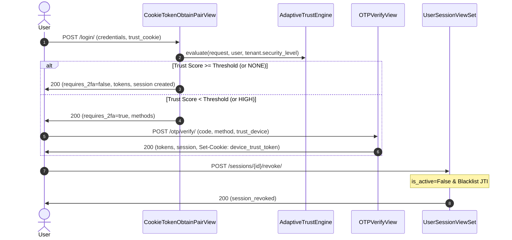

<Design: Adaptive Authentication and Session Management>
## Technical Approach
The authentication subsystem in `Monitor_Atlas` introduces adaptive risk-based authentication, 4-tier tenant security policies, multi-channel MFA, and active session management. `Tenant` gains `security_level` (`NONE`, `LOW`, `MEDIUM`, `HIGH`, default `MEDIUM`). `users/models.py` adds `UserSession` (tracking `refresh_token_jti`, device metadata, trust hash, IP, and status), `UserTwoFactorMethod` (`EMAIL`, RFC 6238 `TOTP`), and `UserBackupCode` (single-use hashes), registered in `auditlog`.

`AdaptiveTrustEngine` calculates a normalized `[0, 100]` score evaluating trust cookies, IP/subnet, User-Agent, recency, and anomalies. `CookieTokenObtainPairView` evaluates score against tenant thresholds (`LOW`: 60, `MEDIUM`: 75, `HIGH`: no bypass, `NONE`: bypass always), bypassing 2FA on trusted logins or returning `requires_2fa: true`. `OTPVerifyView` verifies email, standard library TOTP (`users/totp_service.py`), or backup codes, issuing an HTTP-Only `device_trust_token` cookie on trust. `UserSessionViewSet` lists active sessions (`is_current`) and revokes sessions via SimpleJWT token blacklisting.

## Architecture Decisions
### Decision: Trust Engine Model
|Option|Tradeoff|Decision|
|---|---|---|
|External Fraud API|Latency, network failure risk, and privacy leaks|Rejected|
|DB Rule Engine|High query overhead during high-throughput logins|Rejected|
|In-Memory Heuristic Engine|Deterministic, zero-latency score clamped to `[0, 100]`|Selected|

### Decision: Session Revocation Mechanism
|Option|Tradeoff|Decision|
|---|---|---|
|Cache Whitelist|Session loss on Redis evictions|Rejected|
|Short Access Token TTL|Revoked sessions remain active until token expiry|Rejected|
|SimpleJWT Token Blacklist|Deactivates session and blacklists refresh token JTI|Selected|

### Decision: TOTP Implementation
|Option|Tradeoff|Decision|
|---|---|---|
|External PyPI Library|Extra dependency and CVE exposure|Rejected|
|Standard Library RFC 6238|Native `hmac`, `hashlib`, `struct`, `base64`, `secrets` (±1 drift)|Selected|

## Data Flow

## File Changes
|File|Action|Description|
|---|---|---|
|`Monitor_Atlas/organizations/models.py`|Modify|Add `security_level` (`NONE`, `LOW`, `MEDIUM`, `HIGH`) to `Tenant`.|
|`Monitor_Atlas/users/models.py`|Modify|Add `UserSession`, `UserTwoFactorMethod`, `UserBackupCode` with `auditlog`.|
|`Monitor_Atlas/users/totp_service.py`|Create|RFC 6238 TOTP engine, Base32 secrets, `otpauth://` URIs, backup codes.|
|`Monitor_Atlas/users/trust_engine.py`|Create|`AdaptiveTrustEngine` scoring requests `[0, 100]` against tenant policies.|
|`Monitor_Atlas/users/serializers.py`|Modify|Add `UserSessionSerializer`, TOTP serializers; update `OTPVerifySerializer`.|
|`Monitor_Atlas/users/views.py`|Modify|Refactor login/verify views; add `UserSessionViewSet` and MFA views.|
|`Monitor_Atlas/users/urls.py`|Modify|Register routes for sessions and TOTP setup/activate/deactivate.|
|`Monitor_Atlas/users/migrations/0002_adaptive_auth_sessions.py`|Create|Schema migration for session, MFA, and tenant security models.|
|`Monitor_Atlas/tests/test_adaptive_auth_sessions.py`|Create|Tests for trust scoring, TOTP drift, backup codes, and revocation.|

## Interfaces / Contracts
- `POST /api/v1/users/login/`: Body `{"username", "password"}` -> 200 `{"requires_2fa": false, "access", "refresh"}` or `{"requires_2fa": true, "available_methods"}`.
- `POST /api/v1/users/auth/otp/verify/`: Body `{"username", "code", "method", "trust_device"}` -> 200 `{"access", "refresh"}` + `Set-Cookie: device_trust_token=...`.
- `GET /api/v1/users/sessions/`: 200 list of `UserSessionSerializer` (`is_current: bool`).
- `POST /api/v1/users/sessions/{id}/revoke/`: 200 `{"status": "session_revoked"}`.
- `POST /api/v1/users/sessions/revoke_others/`: 200 `{"status": "other_sessions_revoked"}`.
- `POST /api/v1/users/auth/mfa/totp/setup/`: 200 `{"secret", "otpauth_uri"}`.
- `POST /api/v1/users/auth/mfa/totp/activate/`: Body `{"code"}` -> 200 `{"backup_codes": [...]}`.
- `POST /api/v1/users/auth/mfa/totp/deactivate/`: Body `{"password"}` -> 200 `{"status": "totp_deactivated"}`.

## Testing Strategy
|Test Area|Scope|Verification|
|---|---|---|
|Tenant Policies|`Tenant.security_level`|Verifies bypass on `LOW`/`MEDIUM`; denied on `HIGH`|
|Adaptive Trust|`AdaptiveTrustEngine`|Validates score weights, clamping, and travel penalties|
|RFC 6238 TOTP|`totp_service.py`|RFC vectors, ±1 step drift, backup code consumption|
|Session Controls|`UserSessionViewSet`|Identifies `is_current`, revokes session and other sessions|
|Token Blacklist|SimpleJWT integration|Refresh returns 401 for revoked session refresh token JTIs|

## Threat Matrix
|Threat|Severity|Impact|Mitigation|
|---|---|---|---|
|Credential Stuffing|High|Account takeover|Unrecognized devices trigger mandatory 2FA|
|Clock Drift Desync|Medium|User locked out|RFC 6238 ±1 time-step window tolerance|
|Dangling Session|High|Continued token refresh|Immediate JTI blacklisting via SimpleJWT|
|Backup Code Replay|High|Repeated 2FA bypass|Salted hash check and atomic single-use consumption|

## Migration / Rollout
1. Schema migration: Add `Tenant.security_level` and create session/MFA tables.
2. Data migration: Initialize default `security_level="MEDIUM"` across tenants.
3. Code deployment: Deploy trust engine, TOTP service, and updated auth views.
4. Rollback: Run `python manage.py migrate <app> <prev_migration>` and revert code.

## Open Questions
1. GeoIP Source: Should impossible travel evaluate MaxMind database or reverse proxy headers?
2. Trust Token Rotation: Should device trust tokens rotate on each login or persist until TTL?
</Design: Adaptive Authentication and Session Management>
