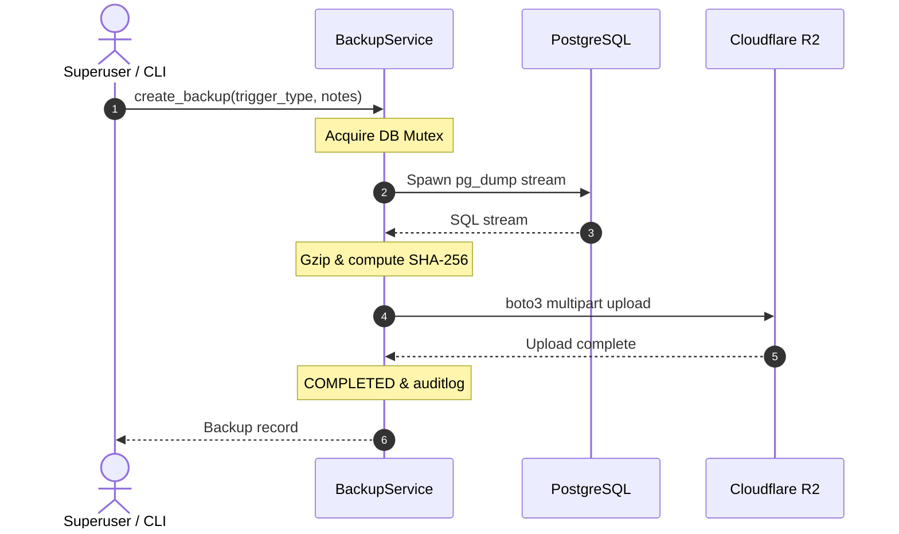

<Design: Database R2 Backups>
## Technical Approach
Implement an auditable backup engine in `Monitor_Atlas`. `DatabaseBackup` in `system/models.py` (16-char ID via `generate_id`, tracking S3 keys, bytes, status, trigger type, initiator, SHA-256 digest, duration, and formatted size) is audited via `django-auditlog`.

`BackupService` in `system/services/backup_service.py` executes `pg_dump` (`--no-owner --no-privileges`), pipes output through gzip, calculates SHA-256 in-flight, and streams multipart chunks to Cloudflare R2 via `boto3.upload_fileobj` without local uncompressed disk storage. A DB mutex prevents overlapping runs with 2-hour stale-lock recovery. REST access is exposed via `DatabaseBackupViewSet` in `system/views.py`, restricted to superusers via `IsSuperUser`. Restorations are strictly CLI-only via `restore_database` requiring `--confirm`, pre-flight SHA-256 check, and connection termination (`pg_terminate_backend`).

## Architecture Decisions
### Decision: Streaming Dump & Upload
| Option | Tradeoff | Decision |
|---|---|---|
| Disk Buffering | High I/O, risk of disk exhaustion | Rejected |
| Memory Buffering | Severe RAM pressure, OOM crashes | Rejected |
| Streaming Pipe to R2 | Zero uncompressed disk footprint, bounded RAM, real-time SHA-256 | Selected |

### Decision: Concurrency Guard
| Option | Tradeoff | Decision |
|---|---|---|
| Redis Lock | Lost on Redis restart or cache evictions | Rejected |
| Celery Deduplication | Unenforced on manual CLI or REST triggers | Rejected |
| DB Mutex with Timeout | Global consistency across CLI, REST, Celery; auto-clears after 2h | Selected |

### Decision: Restore Boundary
| Option | Tradeoff | Decision |
|---|---|---|
| REST Endpoint | Catastrophic risk from accidental calls or web timeouts | Rejected |
| CLI with Confirmation | Enforces operator intent, connection severance, pre-flight hash check | Selected |

## Data Flow

## File Changes
| File | Action | Description |
|---|---|---|
| `Monitor_Atlas/system/models.py` | Create | `DatabaseBackup` model with properties and `auditlog`. |
| `Monitor_Atlas/system/permissions.py` | Create | `IsSuperUser` permission class. |
| `Monitor_Atlas/system/services/backup_service.py` | Create | `BackupService` with streaming dump, R2 client, lock, and restore. |
| `Monitor_Atlas/system/serializers.py` | Modify | Serializers for backup detail, trigger, and presigned URLs. |
| `Monitor_Atlas/system/views.py` | Modify | `DatabaseBackupViewSet` with superuser access; blocks restore (405). |
| `Monitor_Atlas/system/urls.py` | Modify | Mount `/api/v1/system/backups/` router. |
| `Monitor_Atlas/system/management/commands/backup_database.py` | Create | CLI backup command with `--notes`. |
| `Monitor_Atlas/system/management/commands/restore_database.py` | Create | CLI restore command with `--confirm` and hash verification. |
| `Monitor_Atlas/roles/catalog.py` | Modify | Register `system.databasebackup` in RBAC catalog. |
| `Monitor_Atlas/system/migrations/0001_initial.py` | Create | Migration creating `DatabaseBackup` table. |
| `Monitor_Atlas/tests/test_database_backups.py` | Create | Tests for engine, permissions, lock, CLI, and presigned URLs. |

## Interfaces / Contracts
- `GET /api/v1/system/backups/`: Paginated backup list filtered by `status`, `trigger_type`.
- `GET /api/v1/system/backups/{id}/`: Detail with `duration_seconds`, `size_formatted`.
- `POST /api/v1/system/backups/`: Body `{"notes": "..."}` -> 201 Created or 409 Conflict.
- `POST /api/v1/system/backups/{id}/download_url/`: 200 `{"download_url", "expires_in": 900, "filename", "size_bytes", "checksum_sha256"}` (400 if not `COMPLETED`).
- `DELETE /api/v1/system/backups/{id}/`: 204 No Content; purges R2 asset and DB record.
- `POST /api/v1/system/backups/{id}/restore/`: 405 Method Not Allowed.
- CLI: `backup_database [--notes "..."] [--format custom|plain]`
- CLI: `restore_database <backup_id_or_file> --confirm`

## Testing Strategy
| Test Area | Scope | Verification |
|---|---|---|
| Access Control | `DatabaseBackupViewSet` | Superusers pass; non-superusers get 403; anon 401. |
| Streaming Engine | `BackupService.create_backup` | Mock `pg_dump`/`boto3`; verify gzip stream, size, and SHA-256 match. |
| Concurrency Guard | `acquire_concurrency_lock` | Concurrent runs rejected (409/Error); stale locks (>2h) overridden. |
| Restore Integrity | `restore_database` CLI | Hash mismatch halts restore; `--confirm` enforced; connections severed. |
| Presigned URLs | `generate_presigned_download_url` | Validates 900s TTL; rejected on non-`COMPLETED` records. |

## Threat Matrix
| Threat | Severity | Impact | Mitigation |
|---|---|---|---|
| Data Exfiltration | High | Platform data leak | Superusers only; presigned URLs expire in 900s. |
| Accidental Restore | Critical | Data corruption | CLI-only with `--confirm` and hash match. |
| Lock Starvation | Medium | Pipeline blocked | 2h timeout fails dead worker runs. |
| Storage Leaks | Low | R2 cost creep | Abort multipart on failure; purge R2 asset on delete. |

## Migration / Rollout
1. Schema Migration: Run `makemigrations system` and `migrate system`.
2. Catalog Check: Run `check_permissions` to validate RBAC registry.
3. Smoke Test: Run `backup_database --notes "Smoke test"`.
4. Rollback: Run `migrate system zero` and revert commits.

## Open Questions
1. Retention Policy: Configure R2 bucket lifecycle rules or implement Celery pruning?
2. Celery Schedule: Default to daily 02:00 UTC once worker automation is activated?
</Design: Database R2 Backups>
